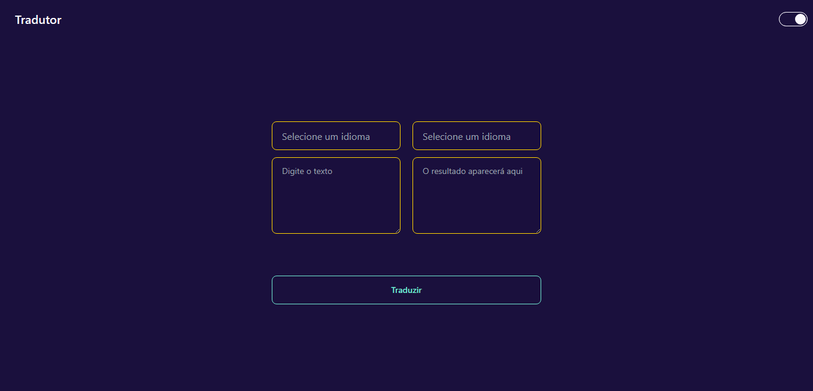

## Sumário

- [Visão geral](#overview)
  - [O desafio](#the-challenge)
  - [Screenshot](#screenshot)
  - [Links](#links)
  - [Tecnologias utilizadas](#built-with)
  - [O que eu aprendi](#what-i-learned)

## Overview

### O desafio

Usuários devem poder:

- Selecionar o idioma do texto de entrada e pra qual idioma deve ser traduzido
- Visualizar a tradução
- Alterar entre tema claro e escuro

### Screenshot

### Links

- Deploy: [Tradutor](tradutor-lyart.vercel.app)

### Construído com

- React
- Typescript
- Tailwind
- CSS
- DaisyUI
- My Memory Translation API

### O que eu aprendi ?
- Consegui melhorar minhas habilidades com Typescript no React 
- Aprendi mais sobre componentização
- Consumo de APIs con React e Typescript
